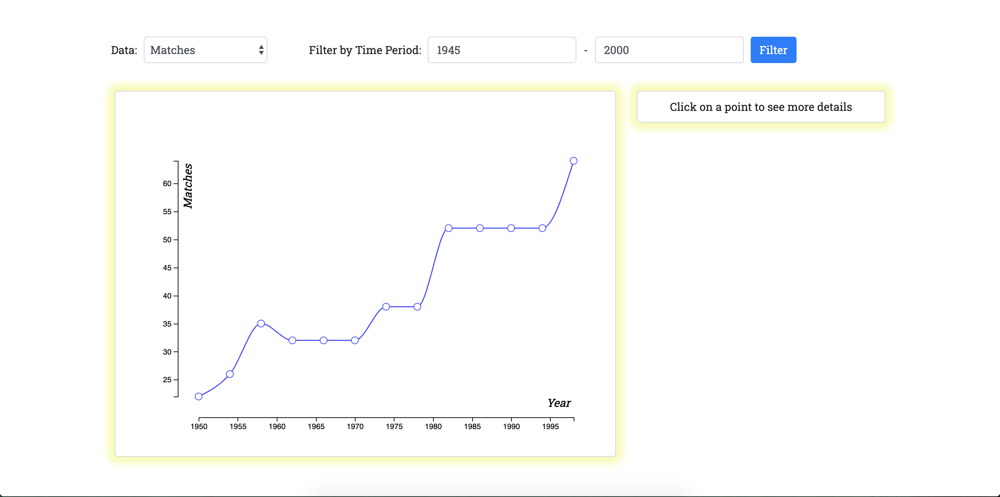

# fifa-data-vis

### HW5
October 13, 2019

Homework and lab assignments for CS Visualization course at the Harvard Extension School.
Practicing transitions with the enter-update-exit pattern and filtering data by time range.

#### Site Layout

#### Interaction

--
### Lab 5
#### Site Layout

